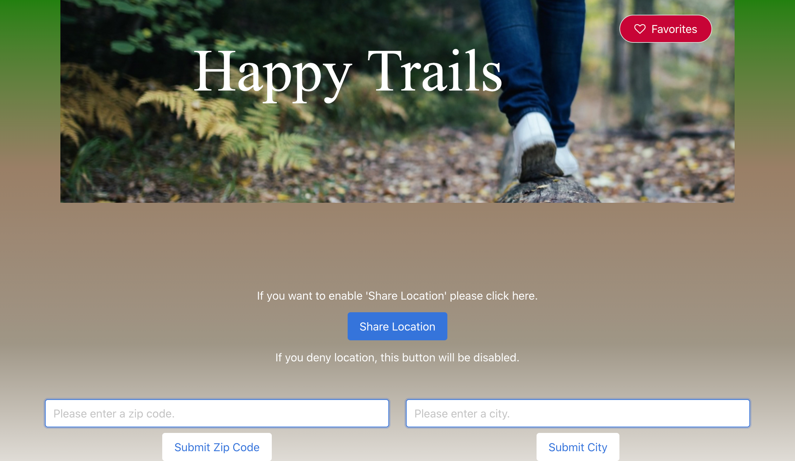
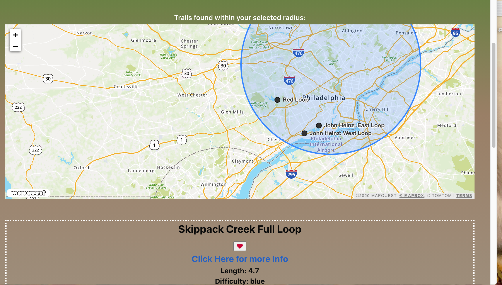

Happy Trails Hiking Application
======================================================================

## Table of Contents

-[Introduction](#Introduction)

-[Technology](#Technologies)

-[Screenshots](#Screenshots)
   
-[Usage](#Usage)

-[Features](#Features)

-[Credits](#Credits)

-[License(#License) 

## Links

* [Deployed Link](https://wyliedavid1984.github.io/HappyTrails/)

## Introduction

We have created an application to appeal to both avid hikers, and people who want to make trail exploration a new part of their lives. 
Happy Trails makes it simple to search for nearby trails, and tailor the list to user specified lengths for their hikes.

## Usage 
When the application loads, the user is prompted to either enable our application to determine their location, or to manually enter their zip code or city. 
Once the user location has been determined, they will be asked to enter how far they are willing to travel to reach their hiking trail, as well as how long of a hike they would like to go on. 
Those user inputs will inform the populating of a map with pin drops at the generated trail locations, as well as a listing of the suggested trails below the map. 

### Buttons
#### "Favorite" button 
Each suggested trail has an option to save it as a "favorite" with the click on the heart icon button beneath the trail name. 
#### "MyFavorites" button
In order for a user to display their saved trails, they will hit the "Favorites" button at the top right of the page. 

### Screen Shots

## Technologies

Technology used to create application

* Javascript
	Javascript and Jquery were used to create the functionality of Happy Trails. We utilized AJAX to pull the necessary data from the respective APIs used for user and trail location, as well as the characteristics of the trails being referenced.

* HTML5
	The framework for structuring Happy Trail’s layout was created using HTML version 5. 

* CSS3
	We utilized the CSS framework Bulma to style the appearance of our application. 

* Bulma
	

* APIs
Mapquest, OpenWeather, HikingProject.com
    

* FontAwesome v3.2.1 
    Used for the heart icon on favorite buttons

### Features
* Geolocation ability
* Map functionality to display pin drops of trail locations
* Local storage of user's favorite trails
* Modal to display saved favorite trails

##Project Challenges
* Initially our team was working to create an app to allow users to avoid crowded locations during our current pandemic. 
Our goal was to integrate Google’s “busy times” feature associated with stores and other destinations. Our first day of development was spent exploring API capabilities, and in the end we realized that Google’s API does not allow the information that we needed about foot traffic to be obtained from their API. We regrouped and decided to pivot to our current project to help people connect with local trails, and spend more time outdoors. 

* Another hurdle that we overcame as a team was learning to merge all of our respective work for the project into Github. When we began, it felt very complex, but now as we are nearing the end of the project we have hit a good rhythm with our pushing and pulling of content while avoiding any merge errors. 

#### In progress:
* We will program the stored favorites function so that saved user searches will not be duplicated if they are indicated as a favorite more than once. 

##Application Expansions in the future:
* GPS functionality for users to obtain their exact location on a given trail map.   
* Up to the minute weather forecast integration.  
* Function to generate driving directions to trail locations.  
* Feature to suggest similar trails to those that users have saved as favorites. 
* Ability for users to connect and view the accounts of other users of their choosing in order to share trails that they have enjoyed.

## Credits

* [W3schools-button functionality](https://www.w3schools.com/default.asp)
* [JQuery documentation](https://api.jquery.com/)
* [FontAwesome for icons ](https://fontawesome.com/v3.2.1/icons/)
* [Stack Overflow general research](https://stackoverflow.com/) 
* [Mdn web docs general research](https://developer.mozilla.org/en-US/)
* [AskBCS bug fixes]
* [JQuery documentation](https://api.jquery.com/)
* [Open Weather api](https://openweathermap.org/api)

## Contact
Created by [@DavidWylie](https://github.com/wyliedavid1984),  [@MeredithJones](https://github.com/meredithajones),  [@MerlinRock](https://github.com/MerlinRock),  [@SomSofari](https://github.com/somisalami12) 